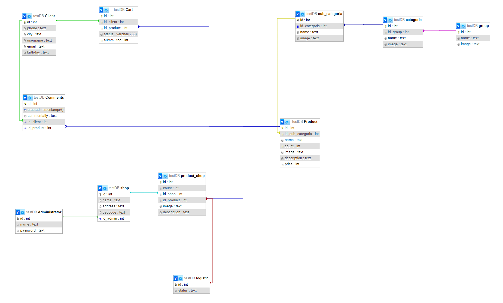
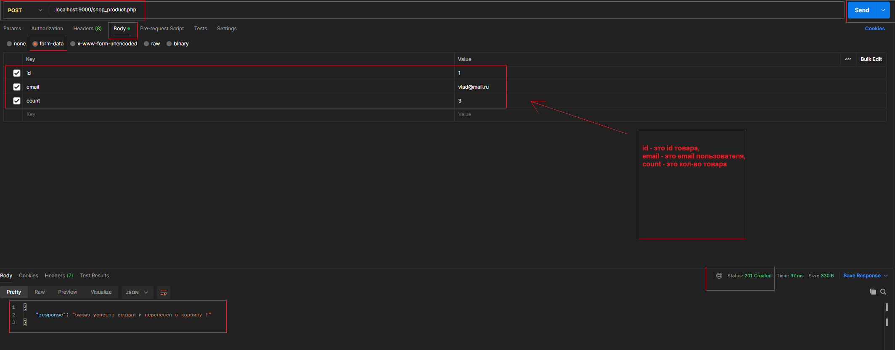
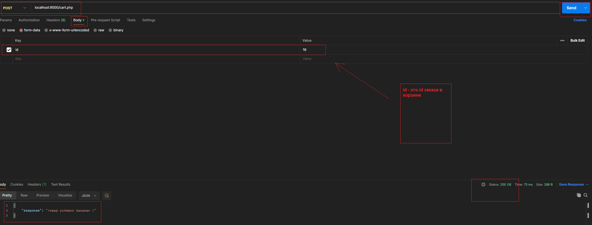
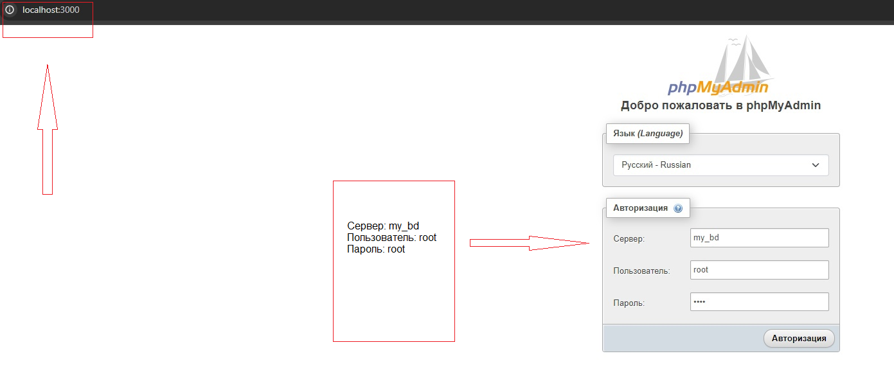
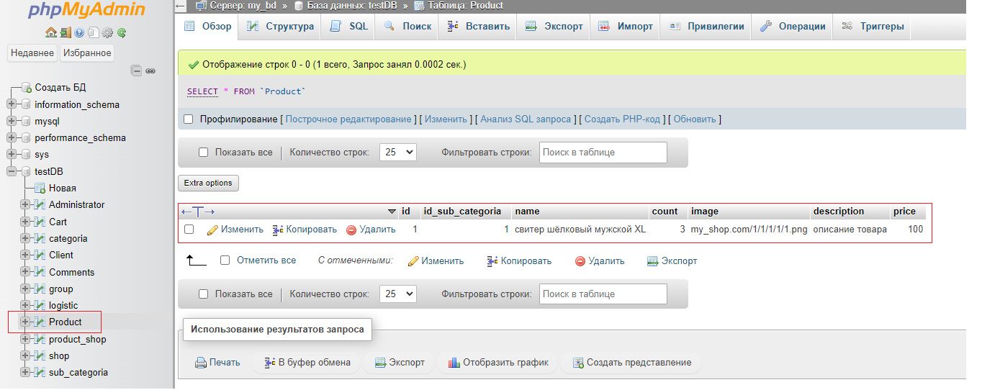
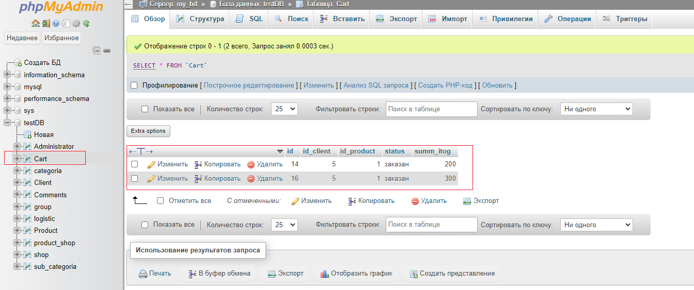
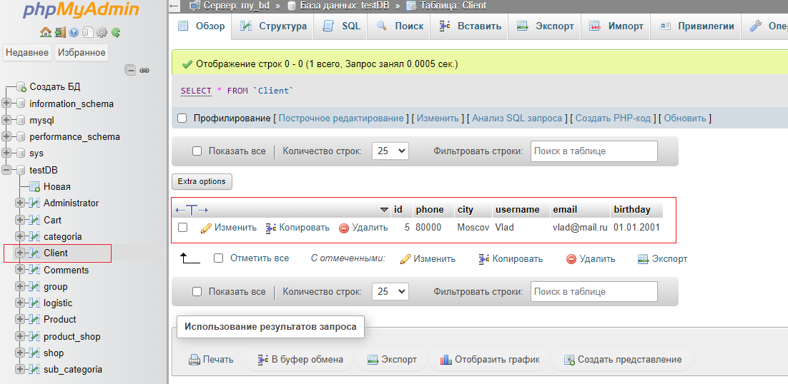

# Прототип API по оформлению заказа

## Задание 1

Для данной ТЗ я выбираю реляционную БД. СУБД - MySQL. Потому что API будет писаться на PHP, а php очень хорошо заточен под реляционные БД, особенно под mysql.

Медиаконтент (изображения, возможно видео демонстрации товара) будет храниться на сервере, но никак не в БД, потому что не рекомендуется хранить дволичные файлы в таблицах, 
я описал в ERwin схеме таблицы и их связи, в тех таблицах, где есть столбец image - будет храниться ссылка на папку с id товара, в котором находятся картинки, поэтому и тип данных в столбце image текстовый.

Рассмотрим теперь плюсы и минусы данной проектированной системы.

Плюсы:

*эффективность работы с медиаконтентом (я избегаю хранить довичные файлы в БД, и это повышает производительность обработки запросов на движок БД)

*удобство разработки (опять же, связь php+mysql является чуть ли не эталоном качества веб-приложений на PHP, почти вся литература по изучению php так или иначе будет связана с mysql, поэтому очень много статей и рекомендацей по разрабтке, то бишь, в случае ошибок/проблем/вопросов - найти ответ будет достаточно просто и быстро)

Минусы:

*Безопасность (т.к. мы храним медаиконтент в файловой системе, то нужно будет задуматься о дополнительных мер безопасности для защиты от несанкционированного доступа, но это уже задача безопасников...)

*Масштабируесть (при увеличении объема медиаконтента и количества пользователей может возникнуть необходимость в масштабировании системы хранения файлов, если у нас на облачных кластерах крутится контент, то при увеличении придётся докупать ГБ, и это потребует дополнительных ресурсов)

## Задание 2

## Задание 3. Инструкция по запуску:
1. В локальной директории из терминала выполняем команду: 

    `git clone https://github.com/vladislavpetrov4311/vk_recponse.git`
2. Переходим в папку с репозиторием vk_recponse и из терминала запускаем: 

    `docker-compose up`

## Пример работы в Postman

### 1. localhost:9000/shop_product.php

`Реализация в файлах: shop_product.php и class_product.php`

### 2. localhost:9000/cart.php

`Реализация в файлах: cart.php и class_cart.php`

### На случай, если нужно просмотреть визуально Базу Данных 

1. Переходим по localhost:3000 

    `!!! Важно !!! Обратите внимание, при самом первом запуске образ mysql из docker-контейнера требует больше времени на развёртывание, поэтому после запуска приложения нужно будет немного подождать`

    

2. База данных testDB, таблица Product

    

3. Таблица Cart

    

4. Таблица Client

    

## Мои контакты

1. `E-mail: petrov_vd_4311@mail.ru`
2. `номер телефона + 7 953 495 88 73`
