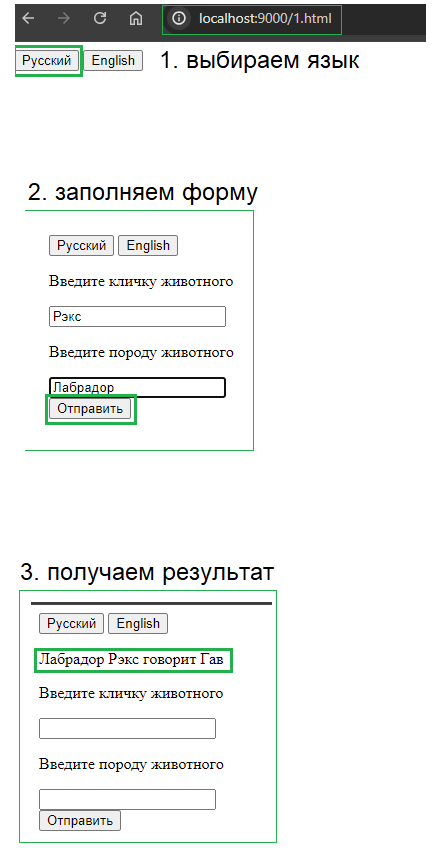

# Инструкция по работе

## Первые два задания (скрипт 1.php и 2.php) можно просто перекопировать и запустить в онлайн интерпретаторе (например, вот тут https://www.programiz.com/php/online-compiler/)

## Третье задание: 

1. `git clone https://github.com/vladislavpetrov4311/vk_recponse/ -b for_vk_respons`
2. `cd vk_recponse/3_task` Переходим в директорию с docker-compose файлом
3. `docker-compose up` Запускаем файл конфигурации развёртывания

  ### Работать с сайтом примерно так:
 